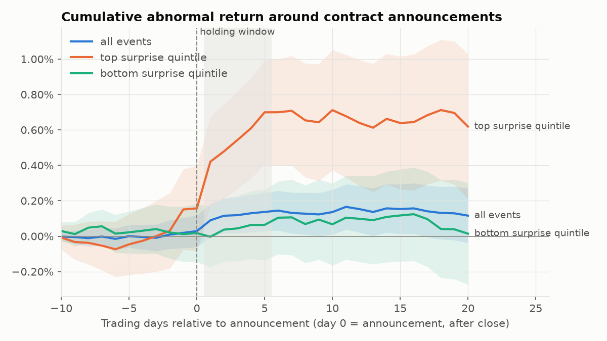
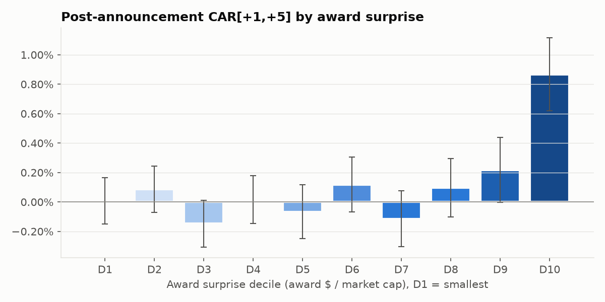
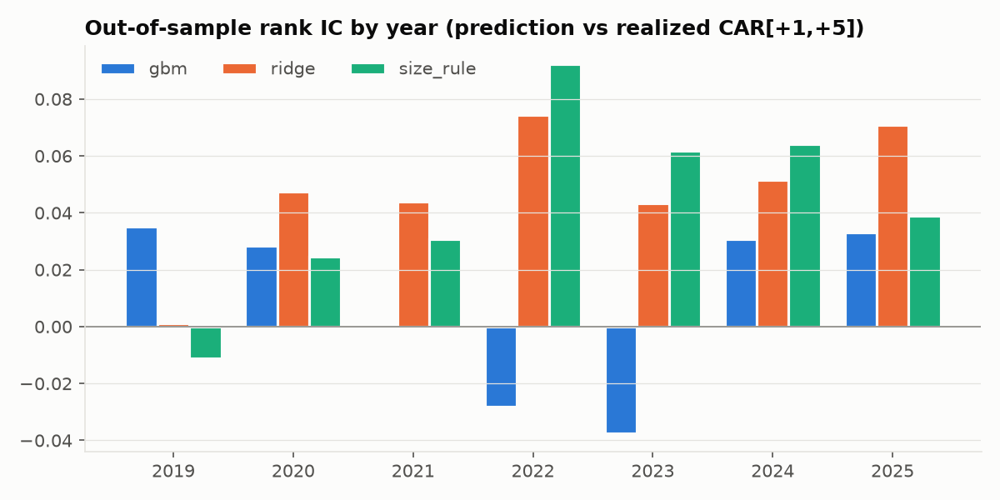
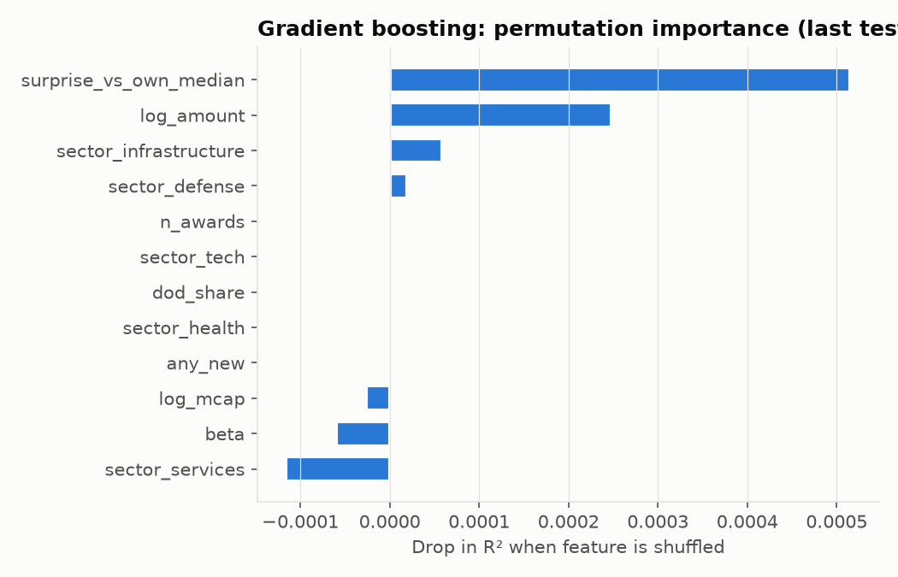
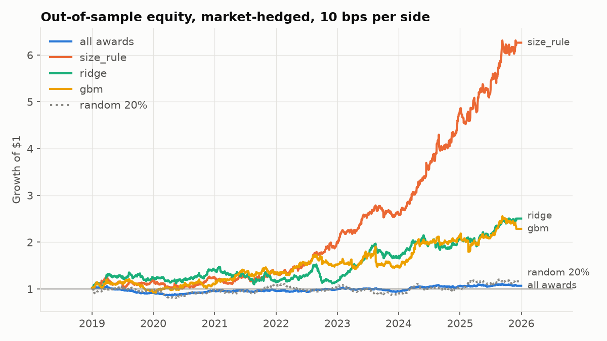

# Public spending → market reaction: run report

Source: **synthetic** · period 2015-01-01 to 2025-12-31 · 17,757 contract actions ≥ $7.5M collapsed into 15,220 firm-day events · 28 stocks · runtime 9.0s

> **These numbers come from synthetic data with a known, injected award effect.** They show that the pipeline works and recovers a signal when one exists. They say nothing about real markets. Run `psmp run --source live` with network access to api.usaspending.gov and a price source to get real results.

## 1. Event study

Market model fit on days −250..−21. Day 0 is the announcement date; the DoD posts awards after the close, so a trade can only start earning on day +1.

| window | events | mean CAR | median | t | Patell z | % positive |
|---|---|---|---|---|---|---|
| pre_car[-2,0] | 15,220 | 0.038% | 0.010% | 1.61 | 1.39 | 50.1% |
| post_car[+1,+5] | 15,220 | 0.108% | 0.068% | 3.56 | 2.88 | 50.8% |

| decile | events | mean CAR[+1,+5] | 95% CI ± |
|---|---|---|---|
| D1 | 1,545 | 0.007% | 0.156% |
| D2 | 1,499 | 0.087% | 0.158% |
| D3 | 1,522 | -0.148% | 0.161% |
| D4 | 1,557 | 0.016% | 0.161% |
| D5 | 1,487 | -0.066% | 0.182% |
| D6 | 1,532 | 0.119% | 0.185% |
| D7 | 1,512 | -0.114% | 0.190% |
| D8 | 1,522 | 0.097% | 0.199% |
| D9 | 1,522 | 0.217% | 0.221% |
| D10 | 1,522 | 0.867% | 0.247% |

## 2. Walk-forward prediction of CAR[+1,+5]

Train on all years before the test year (purged of events whose label window crosses into it), predict the test year, roll forward. `size_rule` ranks by award $ / market cap alone.

| model | mean IC | mean AUC | CAR of picks | CAR of all |
|---|---|---|---|---|
| gbm | 0.009 | 0.502 | 0.338% | 0.102% |
| ridge | 0.048 | 0.517 | 0.417% | 0.102% |
| size_rule | 0.043 | 0.517 | 0.515% | 0.102% |

## 3. Backtest (out-of-sample years only)

Enter at the day-0 close, hold 5 trading days, hedge with the estimation-window beta, equal weight across open positions, 10 bps cost per side. Model strategies take events whose prediction clears the top-20% threshold of that model's *training-set* predictions.

| strategy | trades | hit rate | avg trade | ann. return | ann. vol | Sharpe | max DD | exposure |
|---|---|---|---|---|---|---|---|---|
| all awards | 10,624 | 49.4% | 0.038% | 0.9% | 6.8% | 0.17 | -18.7% | 99% |
| size_rule | 2,179 | 54.8% | 0.549% | 28.8% | 16.7% | 1.60 | -20.6% | 99% |
| ridge | 1,977 | 52.4% | 0.309% | 13.5% | 17.7% | 0.80 | -26.7% | 97% |
| gbm | 1,882 | 51.6% | 0.268% | 12.1% | 19.0% | 0.70 | -23.9% | 98% |
| random 20% | 2,088 | 49.9% | 0.067% | 2.1% | 12.6% | 0.23 | -25.5% | 99% |

## 4. Synthetic ground-truth check

- Injected mean post-announcement effect: 0.113%; event study estimate: 0.108%
- Rank correlation of realized CAR with the injected effect: 0.050 (this is the ceiling on achievable IC: noise dominates)
- Rank correlation of `size_rule` predictions with the injected effect: 0.602
- Rank correlation of `ridge` predictions with the injected effect: 0.413
- Rank correlation of `gbm` predictions with the injected effect: 0.140

## Caveats

- USAspending action dates are the signing date, not always the public announcement date. Announcements can lag by a day, which blurs day 0.
- Market caps are static approximations in `psmp/universe.py`, so the surprise measure is order-of-magnitude only.
- Contract modifications and option exercises are often expected by the market. The `any_new` feature separates them only where the modification number is available.
- The backtest has no borrow or capacity limits, and it assumes you can trade at the close right after the announcement.
