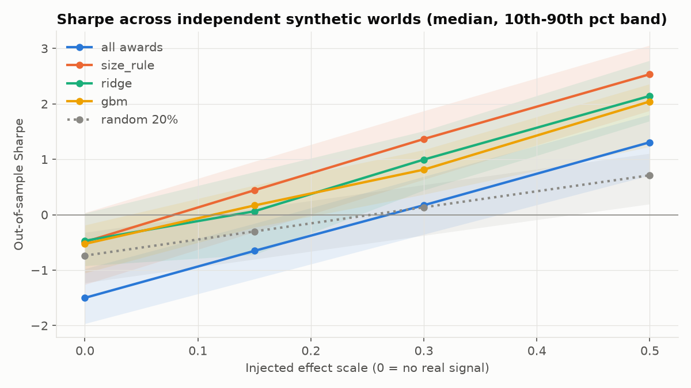

# Robustness sweep

20 independent synthetic worlds per effect scale. Effect scale 0 injects no award effect at all, so any Sharpe there is pure noise (or a bug).

Reading it: with no effect, hedged returns average zero and every strategy pays 10 bps per side on a book that turns over every 5 days. That is roughly -10%/yr for the always-invested `all awards` book, hence its Sharpe near -1.5. Negative Sharpe at scale 0 is the cost drag, not a false signal. The models only beat `random 20%` once a real effect exists, and the simple size rule is the most robust of the three.

| effect scale | strategy | median Sharpe | 10th pct | 90th pct | worlds with Sharpe > 0 | median IC |
|---|---|---|---|---|---|---|
| 0.0 | all awards | -1.50 | -1.97 | -0.97 | 0% | — |
| 0.0 | size_rule | -0.49 | -1.26 | 0.04 | 15% | 0.004 |
| 0.0 | ridge | -0.47 | -0.92 | 0.03 | 15% | 0.028 |
| 0.0 | gbm | -0.53 | -1.05 | -0.19 | 10% | 0.013 |
| 0.0 | random 20% | -0.74 | -1.23 | -0.32 | 0% | — |
| 0.15 | all awards | -0.65 | -1.16 | -0.16 | 0% | — |
| 0.15 | size_rule | 0.44 | -0.31 | 0.96 | 80% | 0.023 |
| 0.15 | ridge | 0.06 | -0.72 | 0.77 | 55% | 0.036 |
| 0.15 | gbm | 0.17 | -0.23 | 0.53 | 65% | 0.020 |
| 0.15 | random 20% | -0.30 | -0.80 | 0.11 | 20% | — |
| 0.3 | all awards | 0.17 | -0.35 | 0.69 | 75% | — |
| 0.3 | size_rule | 1.37 | 0.64 | 1.87 | 100% | 0.041 |
| 0.3 | ridge | 1.00 | 0.44 | 1.51 | 90% | 0.052 |
| 0.3 | gbm | 0.81 | 0.37 | 1.17 | 100% | 0.035 |
| 0.3 | random 20% | 0.13 | -0.37 | 0.54 | 70% | — |
| 0.5 | all awards | 1.31 | 0.71 | 1.81 | 100% | — |
| 0.5 | size_rule | 2.53 | 1.88 | 3.06 | 100% | 0.062 |
| 0.5 | ridge | 2.14 | 1.69 | 2.78 | 100% | 0.071 |
| 0.5 | gbm | 2.04 | 1.23 | 2.36 | 100% | 0.056 |
| 0.5 | random 20% | 0.71 | 0.19 | 1.11 | 100% | — |

